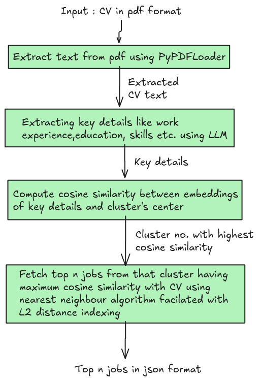
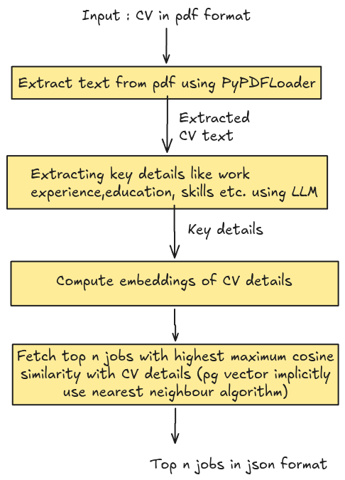

# Job Vacancy Recommendation System

#### Framework used:
- Langchain

#### LLM :
- Llama-3.1-8B (locally using Ollama)

#### Embedding Model:
- Sentence Transformer - msmarco-distilbert-base-v3  
  [Link in Hugging Face](https://huggingface.co/sentence-transformers/msmarco-distilbert-base-v3)

#### Vectorstore:
Implemented the system in two different ways with different vector-store used.
- pgvector with database on Postgres SQL
- FAISS vector-store

#### Input: 
- Pdf file of CV
- Nadika_Poudel_CV__.pdf (Example above )

#### Output:
- Json file with top n recommendations. One on the top is highly relevant than others. 
- faiss_vectorstore/recommendations.json  ( Example above)


## Implementation Details

### CV Parsing
- Extracted the text from PDF using Langchain's PyPDFLoader.
- Extracted text is passed to LLM(Llama 3.1 ) for extracting the key features in json format given below:

```json
{
    "basics": {
        "name": "",
        "email": ""
    },
    "work experience": [
        {
            "company": "",
            "position": "",
            "years": "",
            "description": ""
        }
    ],
    "education": [
        {
            "institution": "",
            "degree": ""
        }
    ],
    "skills": [],
    "projects": [
        {
            "title": "",
            "description": "",
            "technologies": []
        }
    ]
}
```


### Recommendation system

- Implemented using cosine similarity between job description and job vacancy details.
- Top n jobs with the highest cosine similarity with the CV's details is retrieved.

### Job Clustering

- Job clustering is implemented using K-Nearest Neighbout (KNN) algorithm.
- Job vacancy details with the similar embedding vectors are kept in single cluster.
- CV details with the highest cosine similarity among cluster's center is fetched first. Then, the top n jobs with the highest cosine similarity if fetched on that cluster.

## Implementation 1: With FAISS vector store

<p align="center">
  
</p>

- **Probable Issue:** If the semantic similarity with the cluster's center is misleading, the recommendation system fails. So,need to verify that in future work.

## Implementation 2: With pgvector store and Postgres SQL

<p align="center">
  
</p>

- **Current Issues:** Recommendation with the clustering didnot work well. So, need to improve it. 

## Future work:
- Generate test dataset and check the relevancy of the CV with the job vancancy. This will assess the performance of recommendation system.
- Implement hierarchical clustering system.


## Final notes:
Currently, the implementation with the FAISS vector-store is fetching good results. But the implementation with the pgvector sometimes retrieves misleading results.